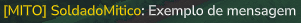
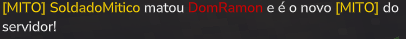

# Documentação plugin Tag Mito PvP

## commandos implementados
**`/setmito`** é responsável por dar a tag mito a alguém (requer mito.admin ou op)

*Caso setmito não seja acompanhado por um nome é assumido self*
```
/setmito
/setmito <player_name>
```

**`/getmito`** é responsável por dizer o nome do mito atual (Aberto a todos)
```
/getmito
```

**`/reloadmito`** é responsável por aplicar as alterações nos JSONs (requer mito.admin ou op)
```
/reloadmito
```

## JSONs customizáveis
### Dentro da pasta *data* irá ter dois *JSONs*:
- ***mito.json*** é responsável por salvar o usuário que tem a tag mito
- ***mito_config.json*** é responsável pelas configurações do plugin

### *mito.json*:
```json
{
  "mito_uuid": "<UUID>",
  "mito_name": "<USERNAME>"
}
```
### *mito_config.json*:
```json
{
  "tag": "[MITO]",
  "sys_tag": "[MITO] ",
  "color": "#FFD700",
  "sys_color": "#FFD700",
  "victim_color": "#D30000",
  "announce_kill": "{sysTag}{new} matou {old} e é o novo {tag} do servidor!",
  "announce_command": "{sysTag}O {new} é o novo {tag} do servidor!"
}
```
- ***"tag"*** representa o texto atrás do nome do usuário e como o comando aparece no chat

- ***"sys_tag"*** representa o texto que aparece atrás dos comandos e {sysTag}

- ***"color"*** representa a cor do usuário, da {tag} e de {new}

- ***"sys_color"*** representa a cor da {systag}

- ***"victim_color"*** representa a cor do {old} nas mensagens

- ***"announce_kill"*** é a mensagem quando o usuário morre por outro player

- ***"announce_command"*** é a mensagem quando o comando /setmito é usado

- ***{tag}*** representa a tag

- ***{sysTag}*** representa a a tag do sistema

- ***{new}*** representa o atacante

- ***{old}*** representa a vitima


## Sistemas adicionais
### ChatFormatter
- **Responsabilidade:** Formatar o texto enviado pelo jogador para mostrar a tag mito atrás do nome
- **Evento usado:** PlayerChatEvent

Exemplo:
```
{tag} [LuckPerms_tag] <Nome_do_jogador>: <mensagem>
``` 
Exemplo no jogo:

Sem LuckPerms:



Com LuckPerms:


### DeathMitoSystem
- **Responsabilidade:** Verificar quando um player com tag MITO morrer por outro player e transferir a tag
- **Evento usado:** classe abstrata DeathSystems.OnDeathSystem
- **Notas:** O sistema de morte tem que ser feito com extends da classe DeathSystems.OnDeathSystem não existe um evento igual o de chat

Exemplo:
```
{sysTag}{new} matou {old} e é o novo {tag} do servidor!
```
Exemplo no jogo:




## Edge cases considerados
- Caso Player morra para PvE a tag MITO não é afetada
- ChatFormatter não apaga sistema de tags do LuckPerms 
- O sistema continua funcionando sem LuckPerms 
- Se o mito sair do servidor os comandos continuam retornando o nome do mito
- Possibilidade de mudar tag mito do sistema para algo diferente da tag do player


## Como usar
Para usar esse plugin coloque a versão compilada ([compiled_version](./compiled_version/MitoPlugin-1.0.1.jar)) dentro da pasta ``/mods`` do mapa/server e se quiser integrar com o [LuckPerms](https://luckperms.net/download) coloque o [LuckPerms](https://luckperms.net/download) na mesma pasta ``/mods``

Para dar acesso aos comandos sem luckperms dê `/op <player>`  

Caso esteja com luckperms rodê o comando abaixo:
```
/lp user <player> permission set mito.admin true
```